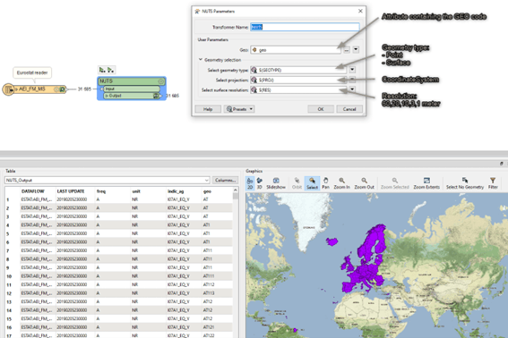

# Adding Geometries

When reading data from Eurostat, by default, no geometries are read. 

Most datasets that come from Eurostat come with a GEO code list (attribute). This Geo code list contains values that may correspond with the NUTS (Nomenclature of Territorial Units for Statistics) codes. These GEO codes in combination with the year of the observation (Time_period) can be combined to find the correct NUTS geometry. This geometry will correspond with the feature at the time of observation.
A custom transformer called “NUTS” can be used in the workspace to add geometries to the features as shown below:

Please note that an observation can have a geocode that represents an aggregate of countries or regions. These observations/features will not get a geometry since they do not correspond to any NUTS object. 