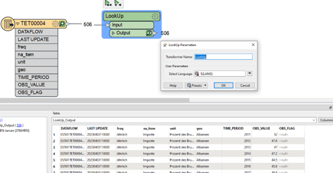

# Adding Code List attributes

When reading data from Eurostat the attributes come in the form of codes. They don’t always clearly indicate what they mean. To get the proper value a lookup must be performed versus the official code lists.
These code lists can be found online by using the following link, where X equals the attribute Name of the cost list.

https://ec.europa.eu/eurostat/api/dissemination/sdmx/2.1/codelist/ESTAT/X

for example:

[https://ec.europa.eu/eurostat/api/dissemination/sdmx/2.1/codelist/ESTAT/FREQ](https://ec.europa.eu/eurostat/api/dissemination/sdmx/2.1/codelist/ESTAT/FREQ)

To make this process easier a custom transformer has been developed that will dynamically change all the attribute values to their corresponding code list value.

The LookUp transformer comes with 1 parameter for the language. This can be either EN, DE or FR. In the example above DE was chosen to get the results in German. The other options correspond to English and French.
This will change values like “A” in the freq attribute to “Annual” or “AL” in geo to “Albania”.

This transformer must do a lookup for each attribute and each feature. It can therefore take quite some time.

To use this custom transformer. You first need to install the “EurostatLoopedLookup.fmx” transformer which is included in the getting started zip file. You can simply install it by Right clicking it and choosing the “Install with FME Workbench” option for the version you want to work in (2022.1 or higher).
