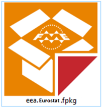
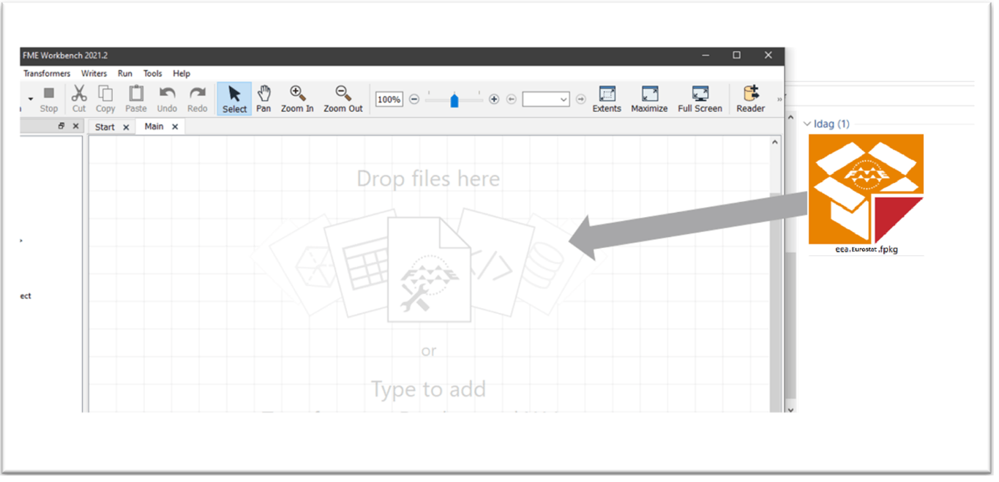
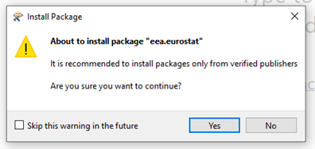

# Getting the package

## Manual install
You can obtain the ".fpkg" package file at GitHub: 

[https://github.com/eea/eea.eurostat.api.fme](https://github.com/eea/eea.eurostat.api.fme).

A sample filename is: `eea.reportnet-0.2.0.fpkg` where `0.2.0` states the version-number.

## Automatic install from FME Hub
This is not yet supported for this package.

FME Hub can be found at [https://hub.safe.com](https://hub.safe.com). Items in FME Hub can be listed and installed from within FME. 

## Installation of the package
When you have downloaded the package-file and have FME installed you are ready to install:
 

It’s recommended to start FME Workbench and drag the package-file onto the FME canvas:
 

Allow the installation of the package:
 

After installation it is recommended to restart FME Desktop and verify the installation.

_(Note that you can double-click the package file to start the installation. However – if you have multiple versions of FME Desktop installed, it will be installed in the default version. By dragging the file into an already started FME session you can control what version the package gets installed to)._