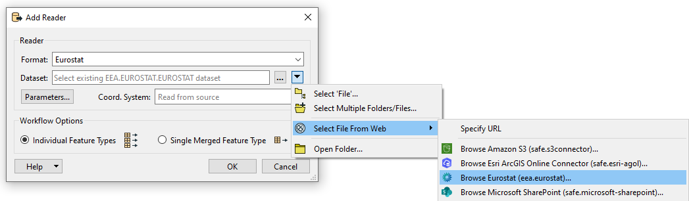
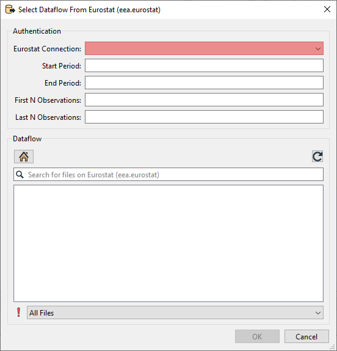
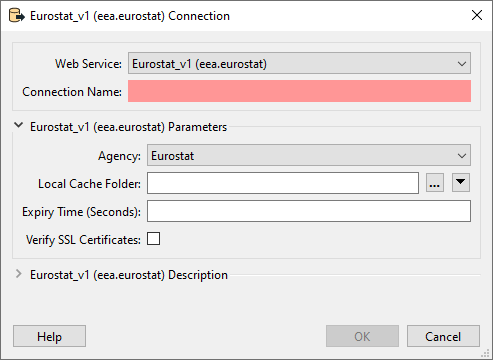
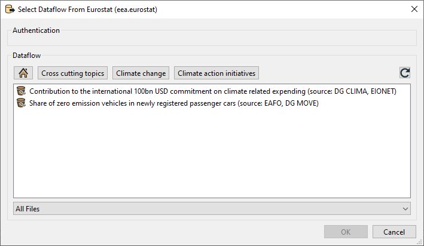

Eurostat Reader Parameters

### Dataset / Authentication

To choose a dataset: 
- Click on the down arrow on the right side of the dataset.
- Choose "Select File From Web".
- Click on "Browse Eurostat (eea.eurostat)".

A new dialog window with the parameters will appear. 

The Eurostat connection is a mandatory parameter that must be set.

- Web service: choose: Eurostat_v1 (eea.eurostat)
- Connection name: choose a name of your choice.
- Agency: The agency determines from which agency data is read. Different Agencys contain different dataflows.
- Local Cache Folder: There are a lot of dataflows to choose from. To avoid loading the list every time the information is stored as cache. This parameter lets you decide where you want to store this cache.
- Expiry Time (Seconds): This parameter determines how long the cache should be saved.
- Verify SSL Certificates: If checked, the reader will verify SSL certificates. 

Once you've set up the webconnection. Click on "OK".

To select a dataflow navigating through the folders to the desired dataflow. 
Only 1 dataset can be chosen at a time.

Select a dataset and click on "ok".

## Optional extra Parameters

### Filter on time

**Optional.** 
Providing a value for Start Period will ensure that data with a Time_Period greater than or equal to the given value will be read.
Providing a value for End Period will ensure that data with a Time_Period less than or equal to the given value will be read.
Values should correspond to the format for Time_Period for the chosen DataFlow. <refer to suitable documentation>

|  Period       | Format                         |
| ------------- | ------------------------------ |
| Annual        | YYYY-A1 or YYYY                |
| Semester      | YYYY-S[1-2]                    |
| Quarter       | YYYY-Q[1-4]                    | 
| Monthly       | YYYY-M[01-12] or YYYY-[01-12]  | 
| Weekly        | YYYY-W[01-53]                  | 
| Daily         | YYYY-D[001-366]                | 
| Year interval | YYYY/P[01-99]Y                 | 

### Filter on first N and last N observations
Optional.  
This allows filtering data observations within a time series to limit the number of observations returned.
Providing values will restrict the reader to only fetch the first N Observations and/or the last N Observations of the DataFlow with consideration taken to the optional Filter on time.
-  This filter may be applied to data which has been filtered by dimension and / or time.
- First N Observations return the first N observations in the corresponding series
- Last N Observations return the last N observations in the corresponding series
- Both definitions may be applied e.g. to return the first and last observations in a series.
- If the filter is wrong, then a response is returned with no observation results.

<!--- ### Expose format attributes full name --->
<!--- Ticking the box will lead to coded values in attributes being translated. --->
<!--- Leaving the box unchecked will leave coded values as they are. --->
