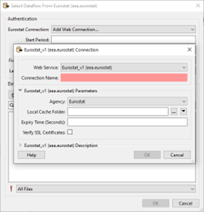
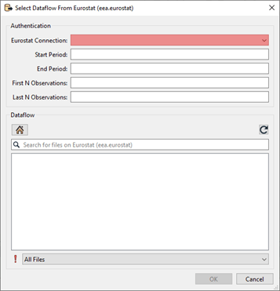
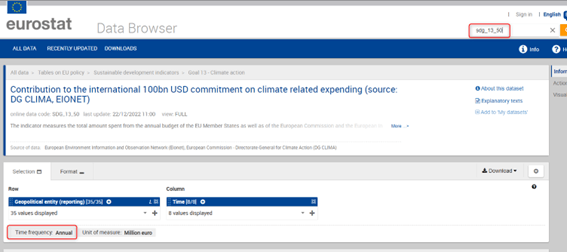
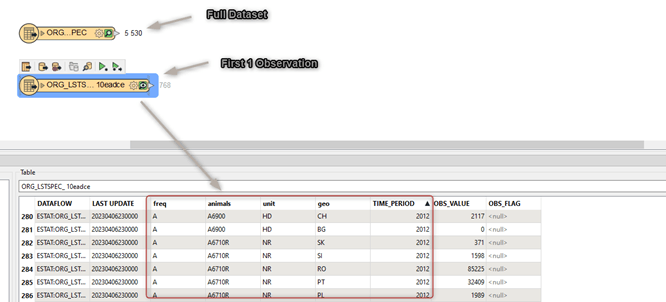
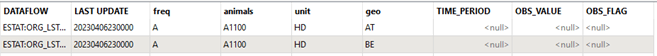
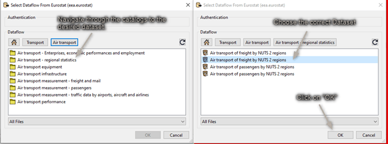
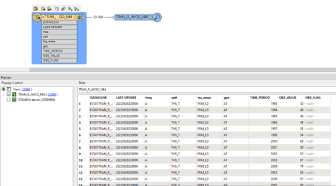

# Adding a Reader in FME

You can add a Eurostat reader in any of the standard ways of FME. 

Choosing a dataset is however only possible from the "Select File From Web" option. An example is shown below:

## Adding a Web Connection.
The first time the reader is used, a web connection must be created. A webconnection is used to be able to easily make a distinction between datasets from different organisations. Right now the Eurostat site does not require authentication. Using a webconnection from the start will allow an easier transition into authentication if this is added in future versions. 

A new webconnection is created by clicking on the "Eurostat Connection", "Add Web Connection...".

The Web Service chosen should be kept at the default "Eurostat_vX(eea.eurostat)". The connection name can be set as the user wants. It is however recommended to give it a clear name. 

For instance:

- Eurostat – Eurostat
- Eurostat – DG COMP

The Agency chosen determines from which organisation data is read.

The Local Cache folder lets you decide where the cache is downloaded to. There are a lot of dataflows to choose from. To avoid loading the list and structure every time, this information is stored in the form of a cache.

The Expiry Time can be set to determine how long the cache should be saved.

## Setting Parameters and choosing a Dataset
Once the web connection is created, you can start choosing a dataset and set the parameters.

 
All the parameters beside the web connection you’ve just created are optional.

### Start and End Period

Providing a value for Start Period will ensure that data with a Time_Period greater than or equal to the given value will be read. Providing a value for End Period will ensure that data with a Time_Period less than or equal to the given value will be read. Values should correspond to the format for Time_Period for the chosen dataflow.

| Period        | Format                        |
| ------------- | ----------------------------- |
| Annual        | YYYY-A1 or YYYY               |
| Semester      | YYYY-S[1-2]                   |
| Quarter       | YYYY-Q[1-4]                   |
| Monthly       | YYYY-M[01-12] or YYYY-[01-12] |
| Weekly        | YYYY-W[01-53]                 |
| Daily         | YYYY-D[001-366]               |
| Year interval | YYYY/P[01-99]Y                |

The parameter used on time period is very strict and can be hard to set properly since the dataflow itself doesn't specify what it accepts in the name. To see which format of filter is allowed it is suggested to look at the Databrowser of Eurostat. Here you can search for the corresponding dataflow either by name or code. The Data browser will then refer to the "Time Frequency" to help you choose the correct format for filtering.

For the dataset shown in the image below. The Start and End Period parameter should correspond to the Period and Format of “Annual”.

### First N/ Last N Observations.

First/Last N Observations allows filtering data observations within a time series to limit the number of observations returned. Providing values will restrict the reader to only fetch the first N Observations and/or the last N Observations of the dataflow with consideration taken to the optional Filter on time.

- This filter may be applied to data which has been filtered by dimension and / or time.
- First N Observations return the first N observations in the corresponding series
- Last N Observations return the last N observations in the corresponding series
- Both definitions may be applied e.g. to return the first and last observations in a series.
- If the filter is wrong, then a response is returned with no observation results.

Keep in mind that N observations does not equal N features. An observation is the unique combination of the code lists for a certain time period. 

As an example: As shown in the image below, when First N observations is set to 1. The first 768 rows of this dataflow are given as a result. This since 2012 is the first observation. But in this case “geo” and “animals” makes them unique for that time period. Making all a first 1 observations.

When setting first/last observations, null values will be read for the Time Period and value attributes. This is done to compliment missing data. For the case shown above for instance, there is no observation for; "Live Horses2 (A1100) in Belgium and Austria, the rows will be added with both "TIME_PERIOD" and "OBS_VALUE" set to `<null>`.

### Parameter limitations and time-outs

It can take time for the backend of Eurostat to prepare this data. Therefore, the reader will be slower and sometimes might time-out the first time. The full datasets are ready to be shipped on Eurostat’s side. These custom filter files need to be created first. Therefore, the first time a filter is set, the back-end of Eurostat needs time to create the file and then get it ready to be downloaded. When filtering there is also a limitation on how many records can be filtered. When using a filter, the maximum number of features that are allowed to be in the result are 1.000.000.

### Choosing the dataset
Once the parameters are set to the users liking, a dataflow can be chosen.

The dataflows shown are based on the organization chosen in the web connection. You can navigate through the folders until you’ve found the desired dataflow. Select it and click on “ok”.

If you know the name or part of the name of the dataflow you are looking for. You can use the search function to quickly find it.

The dataset you select will be represented as Feature Type in FME when you finish adding the Reader:

The Feature Type Name will contain a random UUID as a suffix. This is to ensure that the correct data is read when filters are added afterwards.