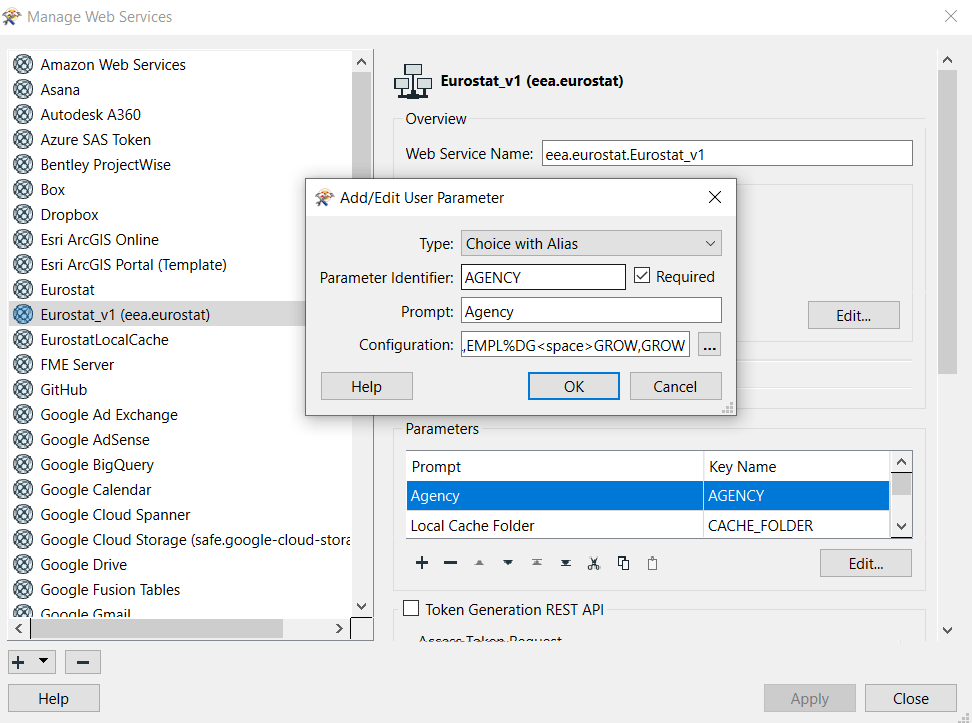

# Dynamic Dataset URL

In cases when it is preferred to compose the dataset URL dynamically, it can be done as follows:

```
fme://eea.fme-eurostat.fme-eurostat/<fme_feature_type_name>.csv
  ?id=<eurostat_dataflow_id>
  &module=fmepy_eurostat.catalog
  &webservice=eea.eurostat.Eurostat
  &connection=<name_of_web_connection>
```

In the template above (linebreaks were inserted for readability), `<fme_feature_type_name>`, `<eurostat_dataflow_id>` and `<name_of_web_connection>` needs to be replaced with appropriate values.

In the example below the dataflow `APRI_LPRC_H` is specified and a connection named `my-eurostat-named-connection` is used:

```
fme://eea.fme-eurostat.fme-eurostat/APRI_LPRC_H.csv
  ?id=APRI_LPRC_H
  &module=fmepy_eurostat.catalog
  &webservice=eea.eurostat.Eurostat
  &connection=my-eurostat-named-connection
```

It is also possible to, instead of referring to a named connection, embed the required parameters of the web service directly in the URL:

```
fme://eea.fme-eurostat.fme-eurostat/APRI_LPRC_H.csv
  ?id=APRI_LPRC_H
  &module=fmepy_eurostat.catalog
  &webservice=eea.eurostat.Eurostat
  &AGENCY=ESTAT
```

The Web Service "Eurostat_v1" has currently only one required parameter, `AGENCY`:



